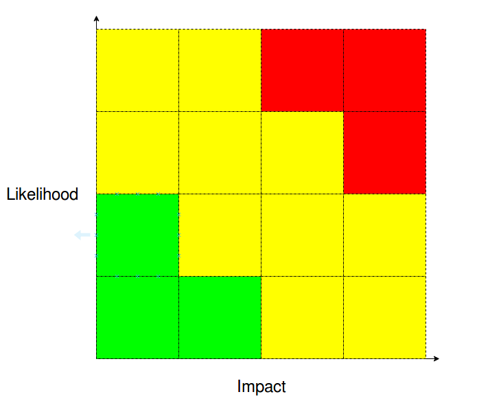

# Chaos Engineering for SQL Server

---

## Andrew Pruski

### SQL Server DBA & Microsoft Data Platform MVP

@fa[twitter] @dbafromthecold  
@fa[envelope] dbafromthecold@gmail.com  
@fa[wordpress] www.dbafromthecold.com  
@fa[github] github.com/dbafromthecold

---

### Session Aim

To provide an overview of Chaos Engineering and discuss how it can be applied to SQL Server

---

### Agenda

Chaos Engineering Definition 
Apply Chaos Engineering to SQL Server 
Running a Chaos Engineering experiment 
Tools for Chaos Engineering 

---

### Netflix - Chaos Monkey

@quote[Chaos Monkey is responsible for randomly terminating instances in production to ensure that engineers implement their services to be resilient to instance failures.](netflix.github.io/chaosmonkey/)

---

### What is Chaos Engineering?

@quote[Chaos Engineering is the discipline of experimenting on a system in order to build confidence in the system’s capability to withstand turbulent conditions in production.](principlesofchaos.org)

---

### What Chaos Engineering is not!

@ul
- Breaking things in production! 
- Staging or Production? 
- Blast Radius 
- Fallout
@ulend

---

# Getting Started

---

### Define your systems

@ul
- Infrastructure 
    - Cloud, private data centre?
- Applications 
    - What's hitting our SQL instances?
- Monitoring 
    - How are we going to analyse the results of our experiments?
- Social 
    - How do people react to systems going down?
@ulend
---

### Past Incident Analysis

How has the system failed previously? 
What technologies/strategies are in place to minimise impact? 
What was learnt from those previous failures? 

---

### Likelihood-Impact Map

---

### Defining an experiment

Which failure has the highest likelihood? 
Which failure has the highest impact? 
What will you gain from testing that failure? 
Is there anything else that can be tested? 
Experiment can be performed manually or scripted 
Organise a time slot to perform the experiment 

---

### Scientific Method

@ol
1. Observation
2. Declaration of the end goal or issue
3. Forming a hypothesis
4. Testing the hypothesis
5. Analysis of results
6. Conclusion
@olend

---

### Running the experiment

Who needs to be involved? 
Active participants vs Observers 
Have a saftey monitor 
Communicate!

---

# Applying to SQL Server

---

### Before you go any further!

@ul
- Check your backups! 
- What is your restore strategy? 
- Disaster Recovery
@ulend

---

### What failure are we going to test?

@ul
- What happens if the primary node in an Availbility Group cluster fails?
@ulend

---

### Defining the experiment

@ul
- Hypothesis
    - The listener of the availbility group should remain online
- Method
    - Stop the SQL database engine service on the primary node
- Rollback
    - Restart the SQL database engine service on the primary node
@ulend

---

### Chaos Toolkit

https://chaostoolkit.org/

---

# Demo

---

# Experiment Two

---

### SQL Server running on Kubernetes

@quote[Kubernetes is a portable, extensible open-source platform for managing containerized workloads and services, that facilitates both declarative configuration and automation. It has a large, rapidly growing ecosystem. Kubernetes services, support, and tools are widely available](kubernetes.io)

---

### KubeInvaders

---

# Demo

---

## Resources

@size[0.8em](https://principlesofchaos.org) 
@size[0.8em](https://github.com/dbafromthecold/SqlServerChaosEngineering) 
@size[0.8em](https://chaostoolkit.org/) 
@size[0.8em](https://github.com/dastergon/awesome-chaos-engineering) 
@size[0.8em](https://github.com/lucky-sideburn/KubeInvaders)

---

## Feedback

