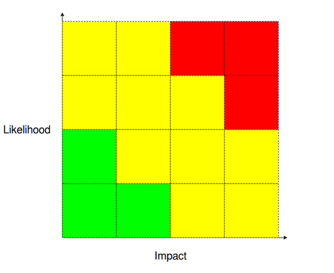

# Chaos Engineering for SQL Server

---

## Andrew Pruski

### SQL Server DBA, Microsoft Data Platform MVP, & Certified Kubernetes Administrator
<!-- .slide: style="text-align: left;"> -->
<i class="fab fa-twitter"></i><a href="https://twitter.com/dbafromthecold">  @dbafromthecold</a> 
<i class="fas fa-envelope"></i>  dbafromthecold@gmail.com 
<i class="fab fa-wordpress"></i>  www.dbafromthecold.com 
<i class="fab fa-github"></i><a href="https://github.com/dbafromthecold">  github.com/dbafromthecold.com</a>

---

### Session Aim

How can Chaos Engineering be applied to SQL Server?

---

# What is Chaos Engineering?

---

### Netflix - Chaos Monkey
<!-- .slide: style="text-align: left;"> -->

"Chaos Monkey is responsible for randomly terminating instances in production to ensure that engineers implement their services to be resilient to instance failures" 
<a href="netflix.github.io/chaosmonkey/">netflix.github.io/chaosmonkey</a>

---

### What is Chaos Engineering?
<!-- .slide: style="text-align: left;"> -->
"Chaos Engineering is the discipline of experimenting on a system in order to build confidence in the system’s capability to withstand turbulent conditions in production"
<a href="principlesofchaos.org">principlesofchaos.org</a>

---

### What Chaos Engineering is not!
<!-- .slide: style="text-align: left;"> -->

- Breaking things in production!

- Staging or Production?

---

# Getting Started

---

### What are we going to test?

<!-- .slide: style="text-align: left;"> -->
- Infrastructure 
    - Cloud, private data centre?
- Applications 
    - What's hitting our SQL instances?
- Monitoring 
    - How are we going to analyse the results of our experiments?
- Social 
    - How do people react to systems going down?

---

### Past Incident Analysis
<!-- .slide: style="text-align: left;"> -->
How has the system failed previously? 
What technologies/strategies are now in place? 
What was learnt from those previous failures? 

---

### Likelihood-Impact Map

---

### Potential scenarios to test!
<!-- .slide: style="text-align: left;"> -->
- High Availability 
    - How will the primary node fail?
- Backups! 
    - Testing our restores
- Monitoring 
    - When were we alerted?
- User error 
    - Running an UPDATE statement without WHERE
- Disaster Recovery 
    - When did we last test our DR strategy?

---

### Defining an experiment
<!-- .slide: style="text-align: left;"> -->
Which failure has the highest likelihood? 
Which failure has the highest impact? 
What will you gain from testing that failure? 
Is there anything else that can be tested?

---

# Running an experiment

---

### What failure are we going to test?
<!-- .slide: style="text-align: left;"> -->
- What happens if the primary node in an Availbility Group cluster fails?

---

### Defining the experiment
<!-- .slide: style="text-align: left;"> -->
- Hypothesis
    - The listener of the availbility group should remain online
- Method
    - Stop the SQL database engine service on the primary node
- Rollback
    - Restart the SQL database engine service on the primary node

---

# Demo

---

# SQL Server running on Kubernetes

---

### What is Kubernetes?
<!-- .slide: style="text-align: left;"> -->
"Kubernetes is a portable, extensible open-source platform for managing containerized workloads and services, that facilitates both declarative configuration and automation. It has a large, rapidly growing ecosystem. Kubernetes services, support, and tools are widely available" 
<a href="kubernetes.io">kubernetes.io</a>

---

# Demo

---

### KubeInvaders

---

# Demo

---

## Resources
<!-- .slide: style="text-align: left;"> -->

<a href="https://principlesofchaos.org">principlesofchaos.org</a> 
<a href="https://github.com/dbafromthecold/SqlServerChaosEngineering">github.com/dbafromthecold/SqlServerChaosEngineering</a> 
<a href="https://chaostoolkit.org">chaostoolkit.org</a> 
<a href="https://github.com/dastergon/awesome-chaos-engineering">github.com/dastergon/awesome-chaos-engineering</a> 
<a href="https://github.com/lucky-sideburn/KubeInvaders">github.com/lucky-sideburn/KubeInvaders</a>

