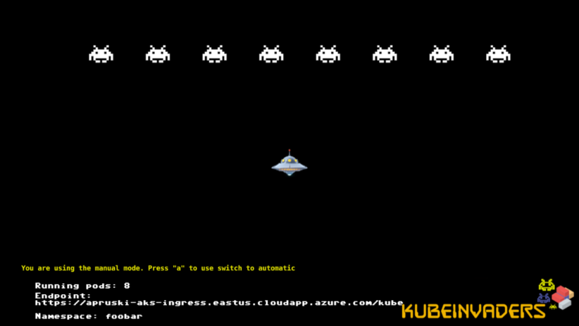

# Chaos Engineering for SQL Server

---

## Andrew Pruski

### Field Solutions Architect
### Microsoft Data Platform MVP

<!-- .slide: style="text-align: left;"> -->
<i class="fab fa-twitter"></i><a href="https://twitter.com/dbafromthecold">  @dbafromthecold</a> 
<i class="fas fa-envelope"></i>  dbafromthecold@gmail.com 
<i class="fab fa-wordpress"></i>  www.dbafromthecold.com 
<i class="fab fa-github"></i><a href="https://github.com/dbafromthecold">  github.com/dbafromthecold</a>

---

### Session Aim
<!-- .slide: style="text-align: left;"> -->
An overview of Chaos Engineering and how it can be applied

---

# Chaos Engineering?

---

### What is Chaos Engineering?
<!-- .slide: style="text-align: left;"> -->
"Chaos Engineering is the discipline of experimenting on a system in order to build confidence in the system's capability to withstand turbulent conditions in production" 
<a href="principlesofchaos.org">principlesofchaos.org</a>

---

### What Chaos Engineering is not!
<!-- .slide: style="text-align: left;"> -->
<ul>
<li class="fragment">Breaking things in production!</li>
<li class="fragment">Staging or Production?</li>
<ul>

---

# Chaos Engineering Implementations

---

### Netflix - Chaos Monkey
<!-- .slide: style="text-align: left;"> -->

"Chaos Monkey is responsible for randomly terminating instances in production to ensure that engineers implement their services to be resilient to instance failures" 
<a href="netflix.github.io/chaosmonkey/">netflix.github.io/chaosmonkey</a>

---

# Getting Started

---

### Past Incident Analysis
<!-- .slide: style="text-align: left;"> -->
How has the system failed previously? 
What technologies/strategies are now in place? 
What was learnt from those previous failures? 

---

### Likelihood-Impact Map

---

### Potential scenarios to test!
<!-- .slide: style="text-align: left;"> -->
<ul>
<li class="fragment">High Availability</li>
    <ul>
        <li class="fragment">How will the primary node fail?</li>
    </ul>
<li class="fragment">Backups!</li>
    <ul>
        <li class="fragment">Testing our restores</li>
    </ul>
<li class="fragment">Monitoring</li>
    <ul>
        <li class="fragment">When were we alerted?</li>
    </ul>
<li class="fragment">User error</li>
    <ul>
        <li class="fragment">Running an UPDATE statement without WHERE</li>
    </ul>
<li class="fragment">Disaster Recovery</li>
    <ul>
        <li class="fragment">When did we last test our DR strategy?</li>
    </ul>	
</ul>

---

### Defining an experiment
<!-- .slide: style="text-align: left;"> -->
Which failure has the highest likelihood? 
Which failure has the highest impact? 
What will you gain from testing that failure? 
Is there anything else that can be tested?

---

# Running an experiment

---

### What failure are we going to test?
<!-- .slide: style="text-align: left;"> -->

What happens if the primary node in an Availbility Group cluster fails?

---

### Defining the experiment
<!-- .slide: style="text-align: left;"> -->
<ul>
<li class="fragment">Hypothesis</li>
    <ul>
        <li class="fragment">The listener of the availbility group should remain online</li>
    </ul>
<li class="fragment">Method</li>
    <ul>
        <li class="fragment">Stop the SQL database engine service on the primary node</li>
    </ul>
<li class="fragment">Rollback</li>
    <ul>
        <li class="fragment">Restart the SQL database engine service on the primary node</li>
    </ul>
</ul>

---

# Demo

---

# SQL Server running on Kubernetes

---

### KubeInvaders

https://github.com/lucky-sideburn/KubeInvaders

---

# Demo

---

## Resources
<!-- .slide: style="text-align: left;"> -->
https://github.com/dbafromthecold/SqlServerChaosEngineering

  

